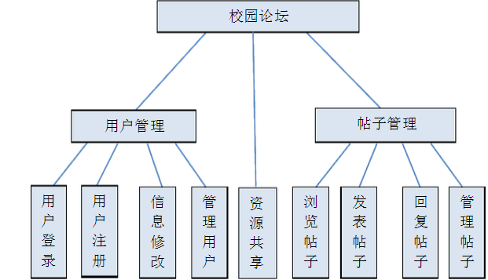
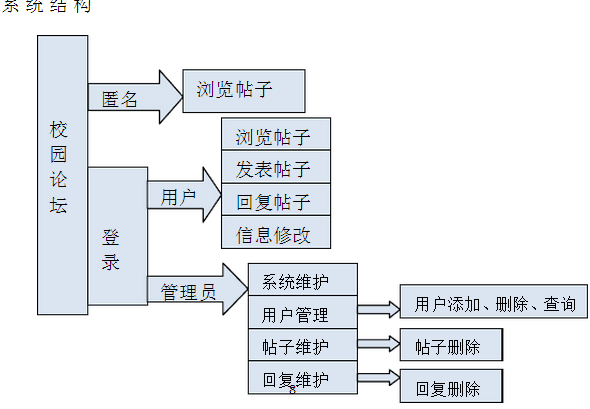

# bbs

2012级毕业设计

## 需求如下

## 快速开始
- 安装MySQL数据库
- 修改root密码为123456
- 创建数据库:bbs
- 在bbs数据库下执行脚本schema.sql
- 安装git版本控制工具
- 安装jdk1.7 
- 安装IntelliJ IDEA
- 打开IDEA, 从 https://github.com/kangyonggan/bbs 把项目拉取到本地
- mvn clean install 打包项目
- mvn tomcat7:run 启动项目, 也可以把war包扔到tomcat/webapps目录下运行

## 技术预览
- Spring
- Mybatis
- SpringMVC
- Freemarker
- Bootstrap
- jQuery
- Html
- CSS
- Javascript

## 其他
- 操作系统:跨平台
- 版本控制工具:Git2.6
- 项目管理工具:Maven3.3
- 数据库:MySQL5.6
- Web容器:Tomcat7
- java运行时:jre7
